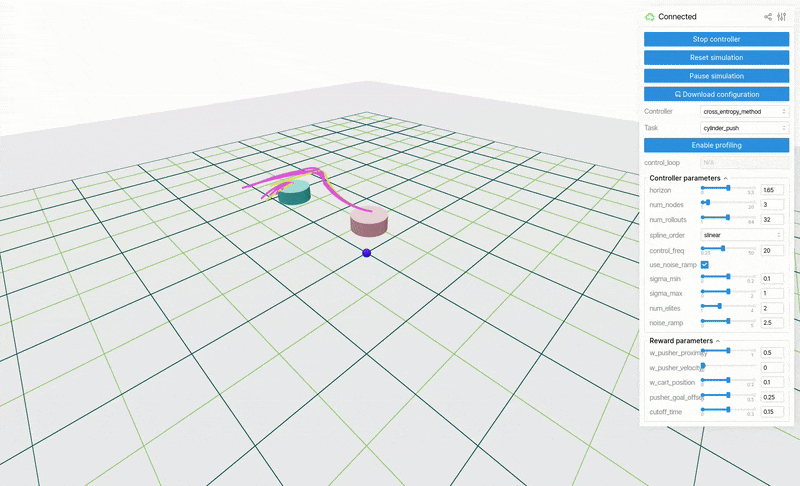

# judo
[](https://github.com/bdaiinstitute/judo/actions/workflows/build.yml)
[](https://codecov.io/gh/bdaiinstitute/judo)
[](https://github.com/bdaiinstitute/judo/actions/workflows/docs.yml)
[](https://bdaiinstitute.github.io/judo)


## Judo: A Unified Framework for Agile Robot Control, Learning, and Data Generation via Sampling-Based MPC



While sampling-based MPC has enjoyed success for both real-time control and as an underlying planner
for model-based RL, recent years have seen promising results for applying these controllers directly
in-the-loop as planners for difficult tasks such as [quadrupedal](https://lecar-lab.github.io/dial-mpc/)
and [bipedal](https://johnzhang3.github.io/mujoco_ilqr/) locomotion as well as
[dexterous manipulation](caltech-amber.github.io/drop/).

`judo` is a simple, `pip`-installable framework for designing and deploying new tasks and algorithms
for sampling-based controllers. It consists of three components:
1. A visualizer based on [`viser`](https://github.com/nerfstudio-project/viser) which enables
3D visualization of system states and GUI callbacks for real-time, interactive parameter tuning.
2. A multi-threaded C++ rollout of `mujoco` physics which can be used as the underlying engine
for sampling-based controllers.
3. `numpy`-based implementations of standard sampling-based MPC algorithms from literature and
canonical tasks (cartpole, acrobot) as `mujoco` tasks.

We also release a simple app that deploys simulated tasks and controllers for better study of how the
algorithms perform in closed-loop.

These utilities are being released with the hope that they will be of use to the broader community,
and will facilitate more research into and benchmarking of sampling-based MPC methods in coming years.

### Installation
Install judo
```
pip install -e .
```

The package contains custom C++ extensions for multi-threaded physics rollouts. These
should be compiled as part of the "typical" python installation, but you may need to
install `cmake` if it is not available on your system:
```
sudo apt install cmake
```

### Getting started
```
viser-app
```
Open the visualizer in your browser by clicking on the link in the terminal.
```
http://localhost:8008/
```

### Run tests locally
In the virtual environment
```
pip install -e .[dev]
python -m pytest
```
you might have to
```
unset PYTHONPATH
```
